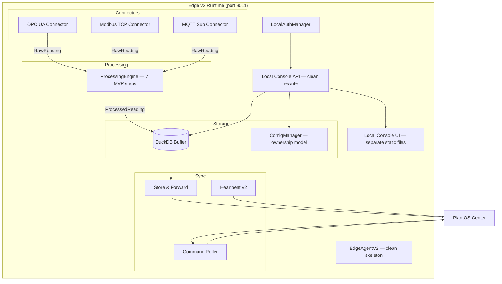
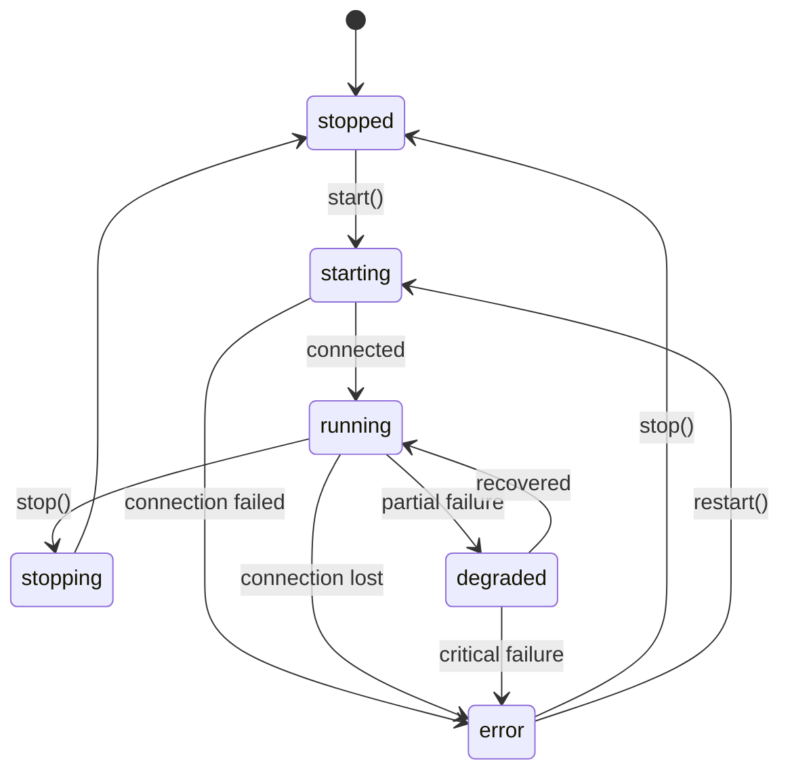
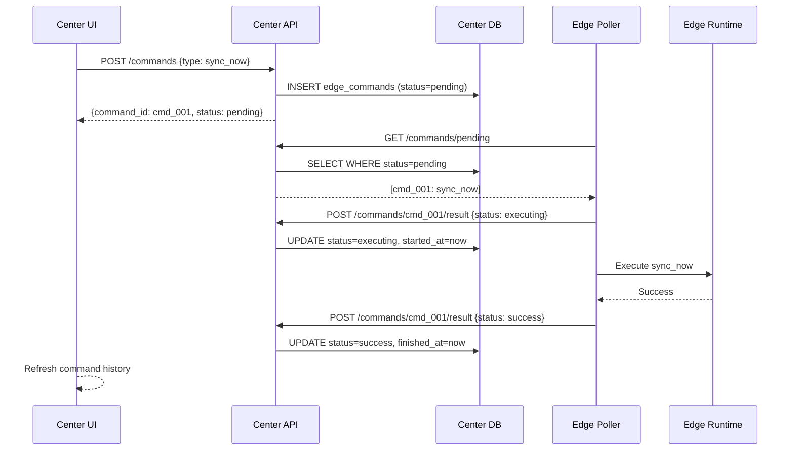

# PlantOS Edge v2 Productization Plan

> **Author:** PM-Designer-Planner (DeepSeek V4 Pro)
> **Date:** 2026-07-08
> **Revision:** 2 — SA Review Incorporated
> **Status:** Approved for Coder Execution
> **Source:** SA Prompt + SA Review Feedback

---

## 1. Executive Summary

### 1.1 Current State

PlantOS Edge v1 is a functional engineering MVP with:
- Python Edge Agent (DuckDB buffer, MQTT publish, HTTP store-and-forward, OPC UA + Modbus collectors)
- Local web server on port 8001 (static HTML UI: Dashboard, Assets, Connections)
- HealthReporter heartbeat to Center
- Center EdgeFleetPage (**broken** — `getEdgeNodes` undefined in frontend, in-memory-only on backend)

Edge v1 successfully serves **WTP-DEMO-01** and **VF-DEMO** demo workspaces but is **not product-grade**: no auth, exposed config secrets, broken Center fleet, no remote management, no packaging.

### 1.2 Product Direction (SA Decision)

```text
Edge v2 Parallel Productization Track
Product name: PlantOS Edge Lite
Positioning: Industrial connectivity + local buffer + simple signal processing
             + quick setup + local visibility + basic remote management
```

Two-track model:
- **Track A**: Edge v1 Stable Baseline — bugfix only, no breaking changes
- **Track B**: Edge v2 Productization Track — isolated parallel development

**Pre-requisite — CF-0**: Fix the broken Center Edge Fleet page **before** Edge v2 development begins, so both v1 and v2 can be monitored from day one.

### 1.3 Key Architecture Decisions

| Decision | Rationale |
|---|---|
| Isolate in `edge-v2/` folder | Zero risk of breaking Edge v1 |
| **Clean skeleton, selective reuse** | Do NOT copy v1 wholesale. Build clean EdgeAgentV2, reuse DuckDB buffer / sync / collectors as libraries |
| Separate workspace `EDGEV2-DEMO` | No contamination of WTP/VF demo data |
| Separate port 8011 | No conflict with Edge v1 on 8001 |
| Separate branch `feature/edge-v2` | Clean merge when ready |
| Backward-compatible heartbeat | Center must accept both v1 and v2 heartbeats |
| Pull-based command queue | No direct Center→Edge connectivity required |
| Docker Compose + systemd | Matches existing PlantOS deployment patterns |
| **Raw + Processed storage** | Both stored in DuckDB with clear schema separation |
| **Config ownership model** | Local-owned vs Center-owned, draft/active/applied states |
| **Safe apply/rollback** | Draft → Validate → Test → Apply → Confirm → Rollback |

---

## 2. Current State Assessment

### 2.1 Edge v1 Component Audit

| Component | Status | Reuse in v2? | Notes |
|---|---|---|---|
| Edge Agent (`edge/agent/main.py`) | ✅ Working | ❌ Do not copy | Global variables, tight coupling — build clean skeleton |
| DuckDB Buffer (`buffer.py`) | ✅ Working | ✅ Reuse as library | Extract class, add raw/processed columns |
| MQTT Publisher (`publisher.py`) | ✅ Working | ✅ Reuse as library | |
| Store-and-Forward (`sync.py`) | ✅ Working | ✅ Reuse as library | Add v2 heartbeat fields |
| HealthReporter (`health.py`) | ✅ Working | ✅ Reuse as library | Add connector status, capabilities |
| OPC UA Collector | ✅ Working | ✅ Refactor to BaseConnector | |
| Modbus Collector | ✅ Working | ✅ Refactor to BaseConnector | |
| Local Web Server (`web.py`) | ✅ Working | ❌ Rewrite | Global state injection, no auth — build clean |
| Local UI (templates/*.html) | ⚠️ Partial | ❌ Rewrite | Inline HTML in Python strings — separate static files |
| `/api/config` | 🔴 Unsafe | ❌ Rewrite | Returns raw config with API keys |
| Auth | 🔴 Missing | ❌ New | Build LocalAuthManager |
| MQTT Collector | ❌ Missing | ❌ New | Build MqttSubscribeConnector |

### 2.2 Center Edge Fleet Audit

| Component | Status | Action |
|---|---|---|
| `edge_nodes` PG table | ✅ Exists, unused | **Wire in CF-0** |
| `EdgeNode` SQLAlchemy model | ✅ Exists, unused | **Wire in CF-0** |
| Heartbeat reception | ⚠️ In-memory only | **Persist in CF-0** |
| `GET /edge-nodes` | ⚠️ In-memory only | **Query DB in CF-0** |
| EdgeFleetPage UI | 🔴 Broken (`getEdgeNodes` undefined) | **Fix in CF-0** |
| `edge.heartbeat` subscriber | 🔴 Not wired | **Register in CF-0** |
| Edge detail endpoint | ❌ Missing | E2V2-4 |
| Command/control APIs | ❌ Missing | E2V2-4 |
| Fleet KPI | 🔴 Hardcoded `"1"` | **Fix in CF-0** |

---

## 3. Product Scope

### 3.1 Must-Have (Edge v2 MVP — Internal Demo Target: E2V2-0 → E2V2-4)

```text
✅ Local login/logout with session cookie
✅ Local Edge Console (Dashboard, Connections, Signals, Sync, Logs, Settings)
✅ OPC UA Client connector (wizard-driven)
✅ Modbus TCP Client connector (wizard-driven)
✅ MQTT Subscribe connector (wizard-driven)
✅ Signal mapping (raw source → signal_id)
✅ 7 must-have processing steps (scale_offset, linear_calibration, clamp,
   moving_average, quality_range, stale_check, baseline_subtract)
✅ DuckDB local buffer (raw + processed schema)
✅ Store-and-forward sync to Center
✅ Center heartbeat v2 (backward-compatible)
✅ Center persistent edge registry (wired in CF-0, enhanced in E2V2-4)
✅ Remote sync_now command
✅ Remote reload_config command
✅ Remote restart_connector command
✅ Basic logs endpoint
✅ Version endpoint
✅ Config ownership model (local-owned vs Center-owned)
✅ Safe apply/rollback for connector config
```

### 3.2 Productization Target (E2V2-5 → E2V2-7)

```text
🟡 Docker Compose packaging
🟡 systemd packaging
🟡 restart_agent via supervisor (systemd/Docker)
🟡 Config backup/restore
🟡 Config versioning
🟡 Support bundle download
🟡 Controlled migration from Edge v1 → Edge v2
```

### 3.3 Should-Have (Post-Internal-Demo)

```text
🔵 Remaining processing steps (median_filter, low_pass, delta, rate_of_change,
   boolean_map, enum_map, unit_conversion, deadband)
🔵 Modbus RTU connector
🔵 HTTP/REST polling connector
🔵 CSV import/export mapping
🔵 Offline mode banner
🔵 Local API key rotation
🔵 Local metrics page (CPU, RAM, disk)
🔵 OPC UA subscription mode
```

### 3.4 Later / Post-MVP

```text
⚪ Siemens S7 read-only connector (post-MVP protocol expansion)
⚪ EtherNet/IP, BACnet/IP, DNP3
⚪ OTA/update package
⚪ mTLS/certificate rotation
⚪ Edge app/plugin marketplace
⚪ Complex rule engine
⚪ AI/ML at edge
⚪ Visual pipeline builder
⚪ Kubernetes/KubeEdge
```

### 3.5 Explicitly Out of Scope

```text
❌ SCADA replacement
❌ PLC programming
❌ Write PLC value / equipment control
❌ Arbitrary shell command from Center
❌ Arbitrary file upload/execute
❌ Full EdgeX clone
❌ Full Litmus Edge clone
❌ Free-form scripting in processing
❌ Visual pipeline builder (MVP)
```

---

## 4. Architecture Proposal

### 4.1 Edge v2 Runtime Architecture (Corrected Dataflow)



### 4.2 Corrected Runtime Dataflow

```text
┌─────────────────────────────────────────────────────────────┐
│                    DATA FLOW (per signal)                    │
│                                                              │
│  Connector.read_tags()                                       │
│       │                                                      │
│       ▼                                                      │
│  RawReading {source_ref, raw_value, ts, quality_hint}       │
│       │                                                      │
│       ▼                                                      │
│  ProcessingEngine.apply(raw_value, profile, history)        │
│       │                                                      │
│       ▼                                                      │
│  ProcessedReading {value, quality, ts}                      │
│       │                                                      │
│       ├──► DuckDB.raw_measurements (ALL raw values)         │
│       │    {ts, signal_id, raw_value, source_ref, connector} │
│       │                                                      │
│       └──► DuckDB.processed_measurements (for sync)         │
│            {ts, signal_id, value, quality, source, synced}   │
│                                                              │
│  StoreAndForward reads from processed_measurements          │
│  (same as v1: POST /api/v1/measurements/ingest)             │
│                                                              │
│  Local Console shows BOTH raw and processed values          │
│  Processing Preview compares raw → processed side-by-side   │
└─────────────────────────────────────────────────────────────┘
```

### 4.3 DuckDB Schema (Raw + Processed)

```sql
-- Raw measurements (all connector reads, never synced to Center)
CREATE TABLE raw_measurements (
    ts          TIMESTAMPTZ NOT NULL,
    signal_id   VARCHAR NOT NULL,
    raw_value   DOUBLE,
    source_ref  VARCHAR,          -- e.g., "ns=2;s=Pump101.Flow"
    connector   VARCHAR,          -- e.g., "opcua_01"
    quality_hint VARCHAR,         -- connector-level quality
    PRIMARY KEY (signal_id, ts)
);

-- Processed measurements (after processing pipeline, synced to Center)
CREATE TABLE processed_measurements (
    ts          TIMESTAMPTZ NOT NULL,
    signal_id   VARCHAR NOT NULL,
    value       DOUBLE,
    quality     VARCHAR,          -- GOOD / STALE / BAD
    source      VARCHAR,          -- edge_node_id
    profile_id  VARCHAR,          -- which processing profile was applied
    synced      BOOLEAN DEFAULT FALSE,
    retry_count INTEGER DEFAULT 0,
    PRIMARY KEY (signal_id, ts)
);

CREATE INDEX idx_raw_signal_ts ON raw_measurements(signal_id, ts);
CREATE INDEX idx_proc_synced ON processed_measurements(synced, ts);
```

### 4.4 Clean Skeleton — NOT a Copy of Edge v1

```python
# edge-v2/agent/main.py — CLEAN SKELETON, selectively reuses v1 libraries

from edge.agent.buffer import DuckDBBuffer        # REUSE as library
from edge.agent.sync import StoreAndForward       # REUSE as library
from edge.agent.health import HealthReporter      # REUSE as library (enhanced)
from edge.agent.publisher import MQTTPublisher     # REUSE as library

from edge_v2.agent.auth import LocalAuthManager           # NEW
from edge_v2.agent.config import ConfigManager             # NEW
from edge_v2.agent.connectors.registry import ConnectorRegistry  # NEW
from edge_v2.agent.processing.engine import ProcessingEngine     # NEW
from edge_v2.agent.commands.poller import CommandPoller          # NEW
from edge_v2.agent.web.server import WebServer                   # NEW


class EdgeAgentV2:
    """Clean-skeleton Edge Agent. Reuses v1 libraries where appropriate,
    builds new Productization Layer from scratch."""

    def __init__(self, config_path: str):
        self.config = ConfigManager(config_path)          # NEW — ownership model
        self.auth = LocalAuthManager(self.config)         # NEW
        self.buffer = DuckDBBuffer(self.config.db_path)   # REUSED from edge.agent.buffer
        self.processing = ProcessingEngine()              # NEW — 7 MVP steps
        self.connectors = ConnectorRegistry(self.config)  # NEW — unified interface
        self.sync = StoreAndForward(                      # REUSED from edge.agent.sync
            ingest_url=self.config.center_ingest_url,
            edge_node_id=self.config.edge_node_id,
        )
        self.health = HealthReporter(                     # REUSED from edge.agent.health
            heartbeat_url=self.config.heartbeat_url,
            edge_node_id=self.config.edge_node_id,
        )
        self.commands = CommandPoller(self.config)        # NEW — pull-based
        self.web = WebServer(                             # NEW — clean rewrite
            config=self.config,
            auth=self.auth,
            buffer=self.buffer,
            connectors=self.connectors,
            processing=self.processing,
            sync=self.sync,
        )

    async def run(self):
        # Start connectors → read raw → process → buffer → sync loop
        ...
```

### 4.5 Key Design Decisions

| Decision | Choice | Rationale |
|---|---|---|
| Runtime language | Python 3.11+ | Same as Edge v1, team familiarity |
| **Code reuse strategy** | Selective library reuse, NOT copy | Clean architecture in v2, battle-tested buffer/sync/publish from v1 |
| Local UI framework | Static HTML/CSS/JS (separate files, not inline) | Fastest path, works offline, zero build. Evaluate React migration post internal demo |
| Local web server | aiohttp (same as v1) | Proven, lightweight |
| Connector model | Unified `BaseConnector` interface | Enables wizard, consistent lifecycle |
| Processing engine | Pipeline of stateless transforms | Simple, testable, no-code |
| Config format | YAML | Human-editable, backward-compatible |
| Command model | Pull-based (Edge polls Center) | Works through NAT/firewall, no inbound ports |
| Auth model | Local bcrypt hash + signed session | Simple, no external IdP needed |
| Center fleet storage | PostgreSQL (wire existing table in CF-0) | Already exists, just needs wiring |

### 4.6 Port & Namespace Isolation

```text
Edge v1:  localhost:8001, node_id=edge-agent-01,    workspace=WTP-DEMO-01/VF-DEMO
Edge v2:  localhost:8011, node_id=EDGEV2-PC-01,     workspace=EDGEV2-DEMO
```

---

## 5. Config Ownership & Safe Apply Model (NEW)

### 5.1 Config Ownership Policy

Not all config is created equal. Some is local-only, some is Center-managed.

```yaml
# Config ownership classification
config:
  local_owned:           # Only editable on the Edge
    - edge_node_id
    - local_admin_hash
    - session_secret
    - center_url
    - api_key
    - buffer.path
    - buffer.retention_days
    - publish.interval_seconds

  center_owned:          # Managed from Center, synced to Edge
    - connectors.*       # Connector definitions
    - processing_profiles.*  # Processing profile definitions
    - signal_mappings.*  # Tag → signal mappings
    - sync.interval_seconds
    - sync.batch_size

  hybrid:                # Editable both sides, conflict rule applies
    - node_name
    - site_id
    - plant_id
```

### 5.2 Config States

```text
┌─────────────────────────────────────────────────────┐
│ Config Lifecycle per Connector/Profile               │
│                                                      │
│  draft ──► validate ──► test ──► active ──► applied │
│    │                    │         │          │        │
│    └── discard          └── fail  └── revert └── OK  │
│                                                      │
│  Draft:    User is editing, not yet validated        │
│  Validate: Schema + required fields + business rules │
│  Test:     Connection test passed (for connectors)   │
│  Active:   Saved to config, marked as current version│
│  Applied:  Connector restarted/reloaded successfully │
└─────────────────────────────────────────────────────┘
```

### 5.3 Safe Apply/Rollback Model

```text
For connector config changes:

1. DRAFT
   User edits connector config in wizard
   → Saved as draft (not active yet)

2. VALIDATE
   Schema validation (all required fields present)
   Business rule validation (no duplicate signal_ids, valid source_ref)
   → Clear error list if validation fails

3. TEST
   test_connection() called on the connector
   → If test fails: show error, stay in draft
   → If test passes: show success, enable "Apply" button

4. APPLY
   Draft promoted to active config
   Config written to YAML with backup of previous version
   Connector reloaded/restarted if needed

5. CONFIRM
   Wait N seconds (configurable, default 30)
   Connector reports running + connected
   → If success: mark as applied, archive previous version
   → If failure: auto-rollback to previous config version

6. ROLLBACK (manual or auto)
   Revert config to last known good version
   Restart connector with old config
   Log rollback reason
```

### 5.4 Conflict Resolution (Center Reconnect)

When Center reconnects after offline period and has pending config changes:

```text
Rule: LAST-WRITER-WINS with safety gate.

1. Center sends config_version + config_hash in heartbeat response
2. Edge compares with local config_version
3. If Center version > local version AND Edge has pending local changes:
   → Edge enters "config_conflict" state
   → Local Console shows: "Config conflict — Center has newer version"
   → User chooses: Accept Center / Keep Local / Manual Merge
4. If Center version > local version AND no local changes:
   → Edge auto-applies Center config
5. If local version > Center version:
   → Edge reports newer version to Center
   → Center updates its record
```

---

## 6. Isolation Strategy

### 6.1 Repository Isolation

```text
edge/                    # Edge v1 — FROZEN (bugfix only)
  agent/                 # Reusable libraries (buffer.py, sync.py, health.py, publisher.py)
    buffer.py            # ← REUSED by Edge v2
    sync.py              # ← REUSED by Edge v2
    health.py            # ← REUSED by Edge v2
    publisher.py         # ← REUSED by Edge v2
    collectors/          # ← REFACTORED into Edge v2 connector interface
  simulator/

edge-v2/                 # Edge v2 — CLEAN SKELETON
  agent/
    main.py              # EdgeAgentV2 — clean, DI-based
    auth/                # NEW — LocalAuthManager
    config/              # NEW — ConfigManager with ownership model
    connectors/          # NEW — BaseConnector + refactored v1 collectors
    processing/          # NEW — ProcessingEngine + 7 MVP steps
    commands/            # NEW — CommandPoller
    web/                 # NEW — clean rewrite, no globals
  console/
    static/              # Separate HTML/CSS/JS files (not inline)
  simulator/
    scenarios/
    protocol_servers/
  tests/
  README.md
  Dockerfile
  docker-compose.edge-v2.yml
  plantos-edge-v2.service
  install.sh
```

### 6.2 Center Workspace Isolation

```text
Workspace: EDGEV2-DEMO
Plant:     EDGEV2-DEMO
Edge Node: EDGEV2-PC-01

Demo Assets:
  EDGEV2-PUMP-101              flow_rate, discharge_pressure, vibration
  EDGEV2-TANK-101              level
  EDGEV2-MOTOR-101             running_status
  EDGEV2-QUALITY-STATION-101   turbidity
  EDGEV2-ENERGY-METER-101      active_power
```

### 6.3 Center API Backward Compatibility

- All new Center endpoints use distinct route prefixes
- Heartbeat endpoint accepts both v1 and v2 formats
- Existing v1 sync/heartbeat flow unchanged
- `edge_nodes` table: add columns only (no breaking changes)

### 6.4 Branch Strategy

```text
main ─── feature/edge-v2
  │           │
  │           ├── CF-0: center fleet baseline fix (merged to main first!)
  │           ├── E2V2-0: isolation + clean skeleton
  │           ├── E2V2-1: local console + auth
  │           ├── E2V2-2: connector wizard
  │           ├── E2V2-3: processing profiles (7 MVP steps)
  │           ├── E2V2-4: center edge manager lite + commands
  │           ├── E2V2-5: packaging (Docker, systemd, restart_agent)
  │           ├── E2V2-6: protocol expansion (Modbus RTU, HTTP Poll)
  │           └── E2V2-7: controlled migration
  │
  └── (Edge v1 stable, bugfix only)
```

---

## 7. Edge v2 Runtime Design

### 7.1 Entry Point (`edge-v2/agent/main.py`) — Clean Skeleton

```python
class EdgeAgentV2:
    """Clean-skeleton Edge Agent. Selectively reuses v1 libraries."""

    def __init__(self, config_path: str):
        self.config = ConfigManager(config_path)
        self.auth = LocalAuthManager(self.config)
        self.buffer = DuckDBBuffer(self.config.db_path)
        self.connectors = ConnectorRegistry(self.config)
        self.processing = ProcessingEngine()
        self.sync = StoreAndForward(
            ingest_url=self.config.center_ingest_url,
            edge_node_id=self.config.edge_node_id,
        )
        self.health = HealthReporter(
            heartbeat_url=self.config.heartbeat_url,
            edge_node_id=self.config.edge_node_id,
        )
        self.commands = CommandPoller(self.config)
        self.web = WebServer(
            config=self.config, auth=self.auth, buffer=self.buffer,
            connectors=self.connectors, processing=self.processing,
            sync=self.sync,
        )
```

### 7.2 Config Manager

```python
class ConfigManager:
    """Loads, validates, saves, versions, and manages config ownership."""

    def load(self) -> EdgeConfig
    def validate(self, config: EdgeConfig) -> list[str]
    def save_draft(self, section: str, config_fragment: dict)         # Draft stage
    def validate_draft(self, section: str) -> list[str]               # Validate stage
    def test_draft(self, section: str, connector_id: str) -> TestResult # Test stage
    def apply_draft(self, section: str) -> str                         # Apply → returns backup path
    def confirm_apply(self, section: str, success: bool)               # Confirm or rollback
    def rollback(self, section: str, backup_path: str) -> EdgeConfig   # Manual rollback
    def backup(self) -> str
    def restore(self, backup_path: str) -> EdgeConfig
    def export_sanitized(self) -> dict                                 # No secrets
    def get_version(self) -> int
    def get_ownership(self, config_key: str) -> Literal["local", "center", "hybrid"]
    def resolve_conflict(self, center_version: int, center_hash: str) -> ConflictResolution
```

### 7.3 Connector Interface

```python
@dataclass
class RawReading:
    """Output from a connector, input to processing engine."""
    source_ref: str           # Protocol-specific: NodeId, register, topic
    signal_id: str
    raw_value: float
    timestamp: datetime
    quality_hint: str | None  # GOOD / UNCERTAIN / null

@dataclass
class ConnectorStatus:
    connector_id: str
    type: str
    status: Literal["running", "stopped", "error", "degraded"]
    connected: bool
    signal_count: int
    last_success_at: datetime | None
    last_error: str | None
    last_error_at: datetime | None
    metrics: ConnectorMetrics

class BaseConnector(ABC):
    connector_id: str
    connector_type: str

    @abstractmethod
    async def start(self) -> None: ...
    @abstractmethod
    async def stop(self) -> None: ...
    @abstractmethod
    async def restart(self) -> None: ...
    @abstractmethod
    async def status(self) -> ConnectorStatus: ...
    @abstractmethod
    async def test_connection(self) -> TestResult: ...
    @abstractmethod
    async def validate_config(self, config: dict) -> list[str]: ...
    @abstractmethod
    async def read_tags(self, tag_configs: list[TagConfig]) -> list[RawReading]: ...
```

### 7.4 Command Poller — Corrected Scope

```python
class CommandPoller:
    """Polls Center for pending commands, executes ALLOWED commands only."""

    # E2V2-4 allowed commands (no supervisor needed):
    ALLOWED_COMMANDS_E2V2_4 = {
        "sync_now",
        "reload_config",
        "restart_connector",
        "enable_connector",
        "disable_connector",
    }

    # E2V2-5 allowed commands (requires Docker/systemd supervisor):
    ALLOWED_COMMANDS_E2V2_5 = {
        "restart_agent",     # Requires supervisor (systemd/Docker restart policy)
    }
```

---

## 8. Local Console Design

### 8.1 UI Technology Decision

| Phase | Technology | Rationale |
|---|---|---|
| E2V2-1 → E2V2-4 (Internal Demo) | Static HTML/CSS/JS, separate files, shared design tokens | Fastest path, offline-capable, zero build |
| Post Internal Demo | Evaluate React/Vite migration | If UI complexity justifies build step |

Design tokens shared with Center via `console/static/css/plantos-tokens.css`.

### 8.2 Information Architecture

```text
Local Edge Console (port 8011)
├── /login              Login page (unauthenticated)
├── /                   Dashboard (protected)
├── /connections        Connection management + wizard
├── /signals            Signal list with raw/processed values
├── /processing         Processing profiles
├── /sync               Sync status & backlog
├── /logs               Log viewer
├── /settings           Settings, config ownership display
└── /logout             Logout
```

### 8.3 Dashboard Page

**Layout:**
```
┌──────────────────────────────────────────────────────┐
│ PlantOS Edge Lite                    [admin] [logout] │
├────────┬────────┬────────┬────────┬────────┬─────────┤
│ Status │ Center │ OPC UA │ Modbus │ MQTT   │ Signals │
│Running │ Online │Connected│Stopped │Connected│   25   │
├────────┴────────┴────────┴────────┴────────┴─────────┤
│                                                       │
│  ┌─ Buffer ─────┐ ┌─ Sync ──────────┐ ┌─ System ───┐ │
│  │ Rows: 12.4K  │ │ Backlog: 0      │ │ CPU: 12%   │ │
│  │ Size: 2.1MB  │ │ Last: 2s ago    │ │ RAM: 180MB │ │
│  │ Retention: 7d│ │ Failed: 0       │ │ Disk: 45%  │ │
│  └──────────────┘ └─────────────────┘ └────────────┘ │
│                                                       │
│  ┌─ Recent Signals ─────────────────────────────────┐ │
│  │ Signal ID              Value    Quality  Time     │ │
│  │ PUMP-101.flow_rate     12.5     GOOD     10:30:01│ │
│  │ PUMP-101.pressure      7.2      GOOD     10:30:01│ │
│  │ TANK-101.level         85.3     GOOD     10:30:01│ │
│  └──────────────────────────────────────────────────┘ │
│                                                       │
│  Version: 2.0.0-dev | Uptime: 3d 4h 12m              │
└──────────────────────────────────────────────────────┘
```

### 8.4 Connections Page — with Safe Apply Flow

**Wizard with Safe Apply:**

```text
Step 1: Select Protocol
Step 2: Enter connection parameters
Step 3: [Validate] → Schema check → Errors/Warnings
Step 4: [Test Connection] → Success/Failure with detail
Step 5: Browse/Discover tags (OPC UA) or manual register entry (Modbus)
Step 6: Map tags to signal_ids, assign processing profiles
Step 7: Review → [Apply] → "Applying config..."
Step 8: Confirm — connector restarted → ✓ Running / ✗ Failed → [Rollback]
```

### 8.5 Signals Page — Raw + Processed

**Table columns:**
```
Signal ID | Raw Source | Raw Value | Processed Value | Quality | Profile | Connector | Time
```

Toggle between "Show Raw" / "Show Processed" / "Show Both".

### 8.6 Processing Page — 7 MVP Steps

Profile editor shows only 7 MVP step types:
```
[scale_offset ▼] [linear_calibration ▼] [clamp ▼] [moving_average ▼]
[quality_range ▼] [stale_check ▼] [baseline_subtract ▼]
```

Remaining 8 steps grayed out with "(Coming Soon)" label.

### 8.7 Settings Page — Config Ownership Display

```text
Config Status:
  Local-owned:  ● Up to date
  Center-owned: ● Synced (version 3)
  Conflict:     None

Config:
  [Backup Config] [Restore Config] [Export Sanitized]

System:
  [View Version Info]
  (Restart Agent — available after E2V2-5 packaging)
```

---

## 9. Connector Design

### 9.1 Connector Registry

```python
CONNECTOR_REGISTRY = {
    "opcua": OpcUaConnector,
    "modbus_tcp": ModbusTcpConnector,
    "mqtt": MqttSubscribeConnector,
    # Post-internal-demo (E2V2-6):
    # "modbus_rtu": ModbusRtuConnector,
    # "http_poll": HttpPollConnector,
    # Post-MVP:
    # "s7": SiemensS7Connector,
}
```

S7 is explicitly **post-MVP**, not in any E2V2 phase.

### 9.2 OPC UA Connector (E2V2-2)

```yaml
connector_id: opcua_01
type: opcua
enabled: true
connection:
  endpoint: opc.tcp://192.168.1.10:4840
  security_mode: None
  username: ""
  password_secret_ref: ""
  timeout: 5.0
  browse_namespaces: [0, 2]        # OPC UA namespace filter
  browse_max_depth: 3              # Limit browse depth
polling:
  interval_ms: 1000
tags:
  - source_ref: ns=2;s=Pump101.Flow
    signal_id: EDGEV2-PUMP-101.flow_rate
    data_type: float
    unit: m3/h
    processing_profile: flow_filter_v1
```

### 9.3 Modbus TCP Connector (E2V2-2)

```yaml
connector_id: modbus_01
type: modbus_tcp
enabled: true
connection:
  host: 192.168.1.20
  port: 502
  unit_id: 1
  timeout: 3.0
polling:
  interval_ms: 1000
tags:
  - source_ref: holding:40001
    signal_id: EDGEV2-PUMP-101.discharge_pressure
    data_type: float32
    scale: 0.1
    offset: 0
    processing_profile: pressure_basic_v1
```

### 9.4 MQTT Subscribe Connector (E2V2-2)

```yaml
connector_id: mqtt_sub_01
type: mqtt
enabled: true
connection:
  broker: 192.168.1.30
  port: 1883
  username: ""
  password_secret_ref: ""
  client_id: edgev2-mqtt-01
subscriptions:
  - topic: plant/line1/pump101/flow
    signal_id: EDGEV2-PUMP-101.flow_rate
    qos: 1
    payload_mode: jsonpath            # jsonpath | plain_text
    payload_path: $.value
    timestamp_path: $.ts
    quality_path: $.quality
```

### 9.5 Connector Lifecycle States



---

## 10. Signal Processing Profile Design (Revised Scope)

### 10.1 Processing Pipeline (Corrected Dataflow)

```text
Connector.read_tags() → list[RawReading]
  → for each RawReading:
      if signal has processing_profile:
          ProcessedReading = ProcessingEngine.apply(raw_value, profile, history)
      else:
          ProcessedReading = passthrough(raw_value, quality="GOOD")
  → Store RawReading in DuckDB.raw_measurements
  → Store ProcessedReading in DuckDB.processed_measurements
  → Sync ProcessedReading to Center
```

### 10.2 MVP Processing Steps (7 Must-Have)

| # | Step Type | Params | Description | Phase |
|---|---|---|---|---|
| 1 | `scale_offset` | `scale: float, offset: float` | `y = x * scale + offset` | E2V2-3 |
| 2 | `linear_calibration` | `a: float, b: float` | `y = a * x + b` | E2V2-3 |
| 3 | `clamp` | `min: float, max: float` | Clamp value to range | E2V2-3 |
| 4 | `moving_average` | `window: int` | Simple moving average | E2V2-3 |
| 5 | `quality_range` | `min: float, max: float` | Set quality BAD if outside range | E2V2-3 |
| 6 | `stale_check` | `max_age_seconds: float` | Set quality STALE if value too old | E2V2-3 |
| 7 | `baseline_subtract` | `baseline: float` | Subtract baseline | E2V2-3 |

### 10.3 Later Processing Steps (Post Internal Demo)

| # | Step Type | Description |
|---|---|---|
| 8 | `median_filter` | Median filter (odd window) |
| 9 | `low_pass` | Exponential smoothing |
| 10 | `delta` | Difference from previous value |
| 11 | `rate_of_change` | Rate of change per second |
| 12 | `boolean_map` | Map bool to values |
| 13 | `enum_map` | Map enum codes to strings |
| 14 | `unit_conversion` | Simple unit conversion |
| 15 | `deadband` | Ignore changes < threshold |

### 10.4 Processing Engine

```python
class ProcessingEngine:
    def apply(self, raw_value: float, profile: ProcessingProfile, 
              history: list[float]) -> ProcessedReading:
        value = raw_value
        quality = "GOOD"
        for step in profile.steps:
            value, quality = self._apply_step(step, value, quality, history)
        return ProcessedReading(value=value, quality=quality)
```

### 10.5 Example Profile

```yaml
processing_profile_id: pressure_basic_v1
name: Pressure Basic Filter
description: Standard pressure signal processing for pump discharge
steps:
  - order: 1
    type: linear_calibration
    params: { a: 0.1, b: 0 }
  - order: 2
    type: moving_average
    params: { window: 5 }
  - order: 3
    type: clamp
    params: { min: 0, max: 16 }
  - order: 4
    type: quality_range
    params: { min: 0, max: 16 }
```

### 10.6 Preview Feature — Raw vs Processed (Enhanced)

```text
Input raw samples: [723, 721, 718, 725, 720]
─────────────────────────────────────────────
Step 1 (linear_calibration ×0.1):
  Raw:     [723,   721,   718,   725,   720]
  Output:  [72.3,  72.1,  71.8,  72.5,  72.0]  quality: GOOD

Step 2 (moving_average w=5):
  Output:  [N/A,   N/A,   N/A,   N/A,   72.1]  quality: GOOD

Step 3 (clamp 0-16):
  Output:  [16.0,  16.0,  16.0,  16.0,  16.0]  quality: GOOD
  ⚠️  5/5 values clamped — check your scale!

Step 4 (quality_range 0-16):
  Output:  [16.0,  16.0,  16.0,  16.0,  16.0]  quality: GOOD

Final: Raw [723, 721, 718, 725, 720] → Processed [16.0, 16.0, 16.0, 16.0, 16.0] [GOOD]
⚠️  Warning: All values hitting clamp ceiling. Review your linear_calibration scale.
```

---

## 11. Center Edge Manager Lite Design (Revised)

### 11.1 CF-0 Scope — Center Fleet Baseline Fix (MUST DO FIRST)

Before any Edge v2 work, fix the current broken Center fleet:

**Tasks (10 tasks, 1 Coder session):**

| # | Area | File | Task |
|---|---|---|---|
| CF-0.1 | Center | `backend/app/modules/edge_nodes/router.py` | Refactor `receive_heartbeat` to upsert into `edge_nodes` table |
| CF-0.2 | Center | `backend/app/modules/edge_nodes/router.py` | Refactor `GET /edge-nodes` to query `edge_nodes` table |
| CF-0.3 | Center | `backend/app/modules/edge_nodes/models.py` | Add `hostname`, `ip_address`, `edge_version` nullable columns to `EdgeNode` |
| CF-0.4 | Center | `backend/migrations/versions/` | Create migration for new columns (nullable, safe) |
| CF-0.5 | Center | `backend/app/main.py` | Register `edge.heartbeat` event subscriber in `_register_event_subscribers()` |
| CF-0.6 | Frontend | `frontend/src/lib/api.ts` | Add `getEdgeNodes()` function calling `GET /api/v1/edge-nodes` |
| CF-0.7 | Frontend | `frontend/src/features/edge-fleet/EdgeFleetPage.tsx` | Fix import of `getEdgeNodes` |
| CF-0.8 | Frontend | `frontend/src/features/edge-fleet/EdgeFleetPage.tsx` | Replace hardcoded KPI with dynamic count |
| CF-0.9 | Test | — | Verify Edge v1 heartbeat persists across Center restart |
| CF-0.10 | Test | — | Verify EdgeFleetPage renders with real data from DB |

**Acceptance:**
```text
✅ Edge v1 heartbeat persists in PostgreSQL across Center restarts
✅ EdgeFleetPage loads real data from API (no undefined function errors)
✅ Fleet KPI shows actual edge node count
✅ Edge v1 sync/heartbeat flow unchanged (backward-compatible)
✅ edge.heartbeat MQTT events are published
```

### 11.2 E2V2-4 Persistent Database Tables

```sql
-- edge_nodes (existing, enhanced in CF-0 + E2V2-4)
ALTER TABLE edge_nodes ADD COLUMN IF NOT EXISTS hostname VARCHAR(255);
ALTER TABLE edge_nodes ADD COLUMN IF NOT EXISTS ip_address VARCHAR(45);
ALTER TABLE edge_nodes ADD COLUMN IF NOT EXISTS edge_version VARCHAR(32);
ALTER TABLE edge_nodes ADD COLUMN IF NOT EXISTS capabilities JSONB DEFAULT '[]';
ALTER TABLE edge_nodes ADD COLUMN IF NOT EXISTS workspace_id VARCHAR(128);

-- NEW tables (E2V2-4):
CREATE TABLE edge_heartbeats (
    id UUID PRIMARY KEY,
    edge_node_id VARCHAR(128) NOT NULL REFERENCES edge_nodes(edge_node_id),
    agent_status VARCHAR(32),
    center_sync VARCHAR(32),
    backlog_count INTEGER DEFAULT 0,
    signal_count INTEGER DEFAULT 0,
    disk_usage_mb FLOAT,
    edge_version VARCHAR(32),
    hostname VARCHAR(255),
    ip_address VARCHAR(45),
    capabilities JSONB DEFAULT '[]',
    received_at TIMESTAMPTZ DEFAULT NOW()
);

CREATE TABLE edge_connectors (
    id UUID PRIMARY KEY,
    edge_node_id VARCHAR(128) NOT NULL REFERENCES edge_nodes(edge_node_id),
    connector_id VARCHAR(128) NOT NULL,
    connector_type VARCHAR(64) NOT NULL,
    status VARCHAR(32) DEFAULT 'unknown',
    signal_count INTEGER DEFAULT 0,
    last_error TEXT,
    last_success_at TIMESTAMPTZ,
    updated_at TIMESTAMPTZ DEFAULT NOW(),
    UNIQUE(edge_node_id, connector_id)
);

CREATE TABLE edge_commands (
    id UUID PRIMARY KEY,
    edge_node_id VARCHAR(128) NOT NULL REFERENCES edge_nodes(edge_node_id),
    command_type VARCHAR(64) NOT NULL,
    target VARCHAR(128),               -- connector_id for restart_connector
    status VARCHAR(32) DEFAULT 'pending',
    requested_by VARCHAR(128),
    created_at TIMESTAMPTZ DEFAULT NOW(),
    expires_at TIMESTAMPTZ,
    started_at TIMESTAMPTZ,
    finished_at TIMESTAMPTZ,
    result_message TEXT
);

CREATE TABLE edge_config_versions (
    id UUID PRIMARY KEY,
    edge_node_id VARCHAR(128) NOT NULL REFERENCES edge_nodes(edge_node_id),
    version INTEGER NOT NULL,
    config_hash VARCHAR(64),
    source VARCHAR(32) DEFAULT 'local', -- 'local' or 'center'
    applied_at TIMESTAMPTZ DEFAULT NOW(),
    applied_by VARCHAR(128),
    UNIQUE(edge_node_id, version)
);
```

### 11.3 E2V2-4 API Endpoints (Revised — NO restart_agent)

| Method | Path | Purpose | Phase |
|---|---|---|---|
| `GET` | `/api/v1/edge-nodes` | List all edge nodes (from DB) | CF-0 |
| `POST` | `/api/v1/edge-nodes/heartbeat` | Receive heartbeat (persist) | CF-0 |
| `GET` | `/api/v1/edge-nodes/{id}` | Edge node detail | E2V2-4 |
| `GET` | `/api/v1/edge-nodes/{id}/connectors` | Connector status list | E2V2-4 |
| `GET` | `/api/v1/edge-nodes/{id}/heartbeats` | Recent heartbeats | E2V2-4 |
| `POST` | `/api/v1/edge-nodes/{id}/commands` | Create command | E2V2-4 |
| `GET` | `/api/v1/edge-nodes/{id}/commands/pending` | Poll pending commands | E2V2-4 |
| `POST` | `/api/v1/edge-nodes/{id}/commands/{cmd_id}/result` | Report command result | E2V2-4 |
| `GET` | `/api/v1/edge-nodes/{id}/commands` | Command history | E2V2-4 |

### 11.4 E2V2-4 Allowed Commands (NO restart_agent)

```python
ALLOWED_COMMANDS = {
    "sync_now",            # Trigger immediate sync flush
    "reload_config",       # Reload config from YAML, re-validate connectors
    "restart_connector",   # Restart individual connector by connector_id
    "enable_connector",    # Enable a disabled connector
    "disable_connector",   # Disable a running connector
}
# restart_agent moved to E2V2-5 (requires supervisor)
```

### 11.5 Edge Detail Page (Center UI)

```text
┌─ Edge Node: EDGEV2-PC-01 ──────────────────────────────┐
│ [Back to Fleet]                                         │
│                                                          │
│ ● Online | v2.0.0-dev | Last heartbeat: 2s ago          │
│                                                          │
│ ┌─ Overview ───────────────────────────────────────────┐│
│ │ Hostname: edge-gw-01        IP: 192.168.1.100        ││
│ │ Signals: 25                 Backlog: 0               ││
│ │ Center Sync: Online         Disk: 120MB              ││
│ │ Workspace: EDGEV2-DEMO                               ││
│ └──────────────────────────────────────────────────────┘│
│                                                          │
│ ┌─ Connectors ─────────────────────────────────────────┐│
│ │ opcua_01    ● Connected    12 signals   [Restart]    ││
│ │ modbus_01   ● Connected     8 signals   [Restart]    ││
│ │ mqtt_sub_01 ● Connected     5 signals   [Restart]    ││
│ └──────────────────────────────────────────────────────┘│
│                                                          │
│ ┌─ Commands ───────────────────────────────────────────┐│
│ │ [Sync Now] [Reload Config]                            ││
│ │ [Restart Agent] ← Disabled (available after E2V2-5)  ││
│ │                                                        ││
│ │ Recent Commands:                                       ││
│ │ sync_now       ✓ Success   2026-07-08 10:25:00        ││
│ │ reload_config  ✓ Success   2026-07-08 10:20:00        ││
│ └──────────────────────────────────────────────────────┘│
└──────────────────────────────────────────────────────────┘
```

### 11.6 Command Execution Flow



### 11.7 E2V2-5: restart_agent via Supervisor

```text
restart_agent implementation:
  - Docker:   docker restart plantos-edge-v2
  - systemd:  systemctl restart plantos-edge-v2
  - Edge prepares for restart (flush buffer, mark command as executing)
  - Edge exits with code 0
  - Supervisor (Docker restart policy / systemd Restart=on-failure) brings it back
  - Edge reports command result on next poll after restart
```

---

## 12. Security Model

### 12.1 Local Edge Auth (E2V2-1)

```text
POST /api/auth/login
  {username, password}
  → Verify against bcrypt hash
  → Set signed session cookie
  → Return {role, redirect}

All /api/* (except /api/auth/login):
  → Check session cookie
  → 401 if missing/invalid

POST /api/auth/logout
  → Clear session cookie
  → Redirect to /login
```

**First-run behavior:** If no admin password set, force password creation on first access. No default password.

### 12.2 Role Model

| Role | Permissions |
|---|---|
| `viewer` | View dashboard, signals, sync status, logs |
| `admin` | All viewer permissions + edit connections, apply config, restart/reload, change password, manage settings |

### 12.3 Edge-to-Center Auth

MVP: `X-API-Key` header (same as Edge v1). Center validates against `settings.API_KEYS`.

### 12.4 Security Hardening

```text
✅ /api/config returns SANITIZED config (no passwords, no API keys)
✅ All POST endpoints have CSRF protection
✅ Session cookie: HttpOnly, SameSite=Strict
✅ Password: bcrypt hash, minimum 8 chars
✅ No plaintext secrets in logs
✅ Input validation on all API endpoints
```

### 12.5 Explicitly Prohibited

```text
❌ Arbitrary shell command from Center
❌ Arbitrary file upload/execute
❌ Write PLC value / equipment control
❌ Unauthenticated config save
❌ Expose secrets through /api/config
```

---

## 13. Simulator & Test Strategy

### 13.1 Simulator

```text
edge-v2/simulator/
  main.py              # Standalone simulator
  scenarios/
    normal_operation.yaml
    noisy_signal.yaml
    sensor_drift.yaml
    spike_outlier.yaml
    stale_signal.yaml
    bad_quality.yaml
    center_offline.yaml
    backlog_recovery.yaml
    opcua_disconnect.yaml
    modbus_timeout.yaml
    mqtt_broker_down.yaml
    agent_restart.yaml
  protocol_servers/
    opcua_server.py
    modbus_server.py
    mqtt_publisher.py
```

### 13.2 Test Strategy

| Layer | Test Type | Framework | Coverage Target |
|---|---|---|---|
| Connectors | Unit tests | pytest + mocks | >80% |
| Processing | Unit tests | pytest | >90% (pure functions) |
| Sync | Integration tests | pytest + httpx mock | Happy + error paths |
| Auth | Unit tests | pytest | All auth flows |
| Config | Unit tests | pytest | Validation, sanitization, ownership |
| Simulator | Scenario tests | pytest + simulator | All 12 scenarios |
| E2E | Manual + automated | Playwright (later) | Critical paths |

---

## 14. Deployment & Packaging Plan

### 14.1 Docker Compose (E2V2-5)

```yaml
# edge-v2/docker-compose.edge-v2.yml
services:
  plantos-edge-v2:
    build:
      context: .
      dockerfile: Dockerfile
    container_name: plantos-edge-v2
    ports:
      - "8011:8011"
    volumes:
      - ./config:/app/config
      - edge-v2-data:/app/data
    restart: unless-stopped
    environment:
      - EDGE_CONFIG_PATH=/app/config/edge.yaml
    healthcheck:
      test: ["CMD", "curl", "-f", "http://localhost:8011/api/status"]
      interval: 30s
      timeout: 10s
      retries: 3

volumes:
  edge-v2-data:
```

### 14.2 systemd Service (E2V2-5)

```ini
[Unit]
Description=PlantOS Edge Lite v2
After=network.target

[Service]
Type=simple
User=plantos
WorkingDirectory=/opt/plantos-edge-v2
ExecStart=/opt/plantos-edge-v2/venv/bin/python -m agent.main
Restart=on-failure
RestartSec=10
Environment=EDGE_CONFIG_PATH=/etc/plantos-edge-v2/config.yaml

[Install]
WantedBy=multi-user.target
```

### 14.3 Target Hardware

```text
Minimum: 2 CPU, 2GB RAM, 16GB disk, Linux x86_64
Recommended: 4 CPU, 4GB RAM, 32GB SSD
```

---

## 15. Roadmap — Revised Phase Order

```text
CF-0 (Center Fleet Baseline Fix) ← MUST DO FIRST
  │
  └──► E2V2-0 (Isolation + Clean Skeleton)
         │
         └──► E2V2-1 (Local Console + Auth)
                │
                └──► E2V2-2 (Connector Wizard + Safe Apply)
                       │
                       └──► E2V2-3 (Processing Profiles — 7 MVP steps)
                              │
                              └──► E2V2-4 (Center Edge Manager Lite)
                                     │
                                     ├── 🎯 INTERNAL DEMO TARGET 🎯
                                     │
                                     └──► E2V2-5 (Packaging + restart_agent)
                                            │
                                            └──► E2V2-6 (Modbus RTU + HTTP Poll)
                                                   │
                                                   └──► E2V2-7 (Controlled Migration)
```

### Timeline (Recalibrated with Buffer)

| Phase | Coder Sessions | Dev Days | Buffer | Total |
|---|---|---|---|---|
| **CF-0** | 1 | 1 | 0.5 | **1.5** |
| **E2V2-0** | 1 | 2 | 0.5 | **2.5** |
| **E2V2-1** | 2-3 | 4 | 1 | **5** |
| **E2V2-2** | 3-4 | 6 | 1.5 | **7.5** |
| **E2V2-3** | 2 | 4 | 1 | **5** |
| **E2V2-4** | 3-4 | 6 | 1.5 | **7.5** |
| | | | | |
| 🎯 **Internal Demo** | **12-15** | **23** | **6** | **~29 days** |
| | | | | |
| **E2V2-5** | 2 | 4 | 1 | **5** |
| **E2V2-6** | 1-2 | 3 | 1 | **4** |
| **E2V2-7** | 1-2 | 3 | 1 | **4** |
| | | | | |
| 🎯 **Productization** | **17-21** | **33** | **9** | **~42 days** |

Buffer includes: human review between phases, test validation, gateway hardware validation (E2V2-5), and documentation updates.

---

## 16. Phase Details — CF-0 (NEW)

### CF-0 — Center Fleet Baseline Fix

**Objective:** Fix the broken Center Edge Fleet so both Edge v1 and Edge v2 can be monitored from day one.

**Dependencies:** None (main branch, before `feature/edge-v2`)

**Tasks (10):**

| # | Area | File | Task |
|---|---|---|---|
| CF-0.1 | Center | `backend/app/modules/edge_nodes/router.py` | Refactor `receive_heartbeat` to upsert into `edge_nodes` table |
| CF-0.2 | Center | `backend/app/modules/edge_nodes/router.py` | Refactor `GET /edge-nodes` to query `edge_nodes` table |
| CF-0.3 | Center | `backend/app/modules/edge_nodes/models.py` | Add `hostname`, `ip_address`, `edge_version` nullable columns |
| CF-0.4 | Center | `backend/migrations/versions/` | Create migration for new columns (nullable, safe) |
| CF-0.5 | Center | `backend/app/main.py` | Register `edge.heartbeat` event subscriber |
| CF-0.6 | Frontend | `frontend/src/lib/api.ts` | Add `getEdgeNodes()` function |
| CF-0.7 | Frontend | `frontend/src/features/edge-fleet/EdgeFleetPage.tsx` | Fix import of `getEdgeNodes` |
| CF-0.8 | Frontend | `frontend/src/features/edge-fleet/EdgeFleetPage.tsx` | Replace hardcoded KPI with dynamic count |
| CF-0.9 | Test | — | Verify heartbeat persists across Center restart |
| CF-0.10 | Test | — | Verify EdgeFleetPage renders with real data |

**Acceptance:**
```text
✅ Edge v1 heartbeat persists in PostgreSQL across Center restarts
✅ EdgeFleetPage loads real data (no undefined function errors)
✅ Fleet KPI shows actual edge node count
✅ Edge v1 sync/heartbeat flow unchanged
✅ edge.heartbeat MQTT events are published
```

---

## 17. Phase Details — E2V2-0 (Revised)

### E2V2-0 — Isolation + Clean Skeleton

**Objective:** Create parallel development environment with clean EdgeAgentV2 skeleton — NOT a copy of Edge v1.

**Dependencies:** CF-0 (Center fleet must be working)

**Tasks (10):**

| # | Area | Task |
|---|---|---|
| 0.1 | Repo | Create `feature/edge-v2` branch, `edge-v2/` directory structure |
| 0.2 | Edge | Create `EdgeAgentV2` clean skeleton class (DI-based, no globals) |
| 0.3 | Edge | Import `DuckDBBuffer` from `edge.agent.buffer` — verify import path |
| 0.4 | Edge | Import `StoreAndForward` from `edge.agent.sync` |
| 0.5 | Edge | Import `HealthReporter` from `edge.agent.health` |
| 0.6 | Edge | Create `config.edge-v2.yaml` with EDGEV2-DEMO settings, port 8011 |
| 0.7 | Simulator | Create `edge-v2/simulator/` with basic sine generator for 5 assets, 7 signals |
| 0.8 | Center | Seed script for EDGEV2-DEMO workspace (5 assets, 7 signals) |
| 0.9 | Test | Verify Edge v1 still runs unchanged after branch |
| 0.10 | Test | Verify Edge v2 skeleton runs independently on port 8011, heartbeat reaches Center |

**Acceptance:**
```text
✅ Edge v1: unchanged, running on port 8001
✅ Edge v2: clean skeleton running on port 8011, node=EDGEV2-PC-01
✅ Edge v2: simulator generates data, heartbeat visible in Center fleet
✅ No regression in Edge v1 functionality
```

---

## 18. Phase Details — E2V2-1 through E2V2-7 (Key Revisions)

### E2V2-1 — Local Console + Auth (17 tasks)

Build on clean skeleton. Web server is a clean rewrite (not copied from v1). Login, logout, session cookie, Dashboard, Signals, Sync, Logs, Settings pages. `/api/config` sanitized. CSRF protection.

### E2V2-2 — Connector Wizard + Safe Apply (28 tasks)

OPC UA, Modbus TCP, MQTT connector wizards. Includes safe apply flow: Draft → Validate → Test → Apply → Confirm → Rollback. Connector lifecycle, heartbeat integration.

### E2V2-3 — Processing Profiles (14 tasks, REDUCED from 17)

Only 7 MVP steps: scale_offset, linear_calibration, clamp, moving_average, quality_range, stale_check, baseline_subtract. Remaining 8 steps grayed out with "Coming Soon". Raw + processed DuckDB schema. Preview with step-by-step output.

### E2V2-4 — Center Edge Manager Lite (25 tasks)

Persistent edge_nodes (wired in CF-0). New tables: edge_heartbeats, edge_connectors, edge_commands, edge_config_versions. Commands: sync_now, reload_config, restart_connector, enable_connector, disable_connector. **NO restart_agent**. Edge detail page. Offline detection. Frontend: EdgeDetailPage, command buttons.

### E2V2-5 — Packaging + restart_agent (18 tasks)

Docker Compose, systemd, install script. restart_agent via supervisor. Config backup/restore. Support bundle. Version endpoint.

### E2V2-6 — Protocol Expansion (9 tasks, REDUCED)

Modbus RTU connector. HTTP/REST polling connector. **S7 removed — post-MVP only.**

### E2V2-7 — Controlled Migration (12 tasks)

Side-by-side v1/v2 comparison. Blue-green switch for WTP/VF workspaces. Rollback runbook.

---

## 19. Acceptance Gates (Revised)

### Gate 0 — Center Fleet Fixed ✅ (CF-0)
```text
✅ EdgeFleetPage works with real data
✅ Heartbeat persists across Center restart
✅ Edge v1 and v2 both visible in fleet
```

### Gate 1 — Isolation (E2V2-0)
```text
✅ Edge v2 runs from edge-v2/ with clean skeleton
✅ Edge v1 still runs unchanged
```

### Gate 2 — Local Console (E2V2-1)
```text
✅ Login/logout works, all /api/* protected
✅ /api/config sanitized (no secrets)
```

### Gate 3 — Protocols (E2V2-2)
```text
✅ OPC UA, Modbus TCP, MQTT wizards work
✅ Safe apply with rollback works
```

### Gate 4 — Processing (E2V2-3)
```text
✅ All 7 MVP steps work, preview shows step-by-step
✅ Raw + processed both stored in DuckDB
```

### Gate 5 — Store-and-Forward (E2V2-3)
```text
✅ Center offline still buffers, reconnect flushes
✅ No duplicated data
```

### Gate 6 — Center Edge Manager (E2V2-4)
```text
✅ Persistent fleet, sync_now/reload_config/restart_connector commands work
✅ Command audit trail visible
```

### Gate 7 — Packaging (E2V2-5)
```text
✅ Docker Compose + systemd install works
✅ restart_agent via supervisor works
✅ Reboot recovery works
```

---

## 20. Open Questions for SA (NEW)

| # | Question | Context | Proposed Answer |
|---|---|---|---|
| **Q1** | UI framework transition: React from E2V2-1 or static first? | Static is faster but doubles work if we switch later. | **Proposed**: Static through internal demo. Evaluate React migration post-demo based on UI complexity. |
| **Q2** | Config source of truth: Center push overwrites local draft? | Conflict resolution defined in §5.4. | **Proposed**: Last-writer-wins with safety gate. Center wins by default, user can choose "Keep Local". |
| **Q3** | Raw vs processed storage retention? | Raw doubles storage but is useful for debugging. | **Proposed**: Raw retention = 3 days default. Processed retention = 7 days (configurable). |
| **Q4** | OPC UA browse scope: full server or filtered? | Full browse can be huge on real servers. | **Proposed**: Namespace filter + max depth (3 levels). Browse Objects folder by default. |
| **Q5** | MQTT payload scope: JSONPath only or plain text too? | Some devices send plain numbers. | **Proposed**: JSONPath for JSON, plain_text mode for numeric topics. Binary later. |
| **Q6** | Local auth sync: admin credentials to Center? | Center manages fleet — should auth be independent? | **Proposed**: Local auth is completely independent. No credential sync. Center cannot read/write local credentials. |
| **Q7** | Target installation mode: Docker first or systemd first? | Docker simpler for devs, systemd standard for industrial. | **Proposed**: Docker Compose for dev/demo. systemd as primary production mode. Both get equal testing. |

---

## 21. Risk Register (Updated)

| # | Risk | L | I | Mitigation | Change |
|---|---|---|---|---|---|
| R1 | Breaking current demo | Low | High | Strict isolation, CF-0 ensures fleet monitoring | — |
| R2 | Over-engineering | Medium | High | Edge Lite scope, 7 not 15 processing steps, S7 post-MVP | ↑ Strengthened |
| R3 | Under-engineering | Medium | Medium | Auth, wizard, command queue in MVP gates | — |
| R4 | Unauthenticated local API | Low | High | Auth is E2V2-1, immediately after skeleton | — |
| R5 | Unsafe remote commands | Low | Critical | Allowlist only, no restart_agent until supervisor exists | ↑ Strengthened |
| R6 | Config drift | Medium | Medium | Config ownership model + versioning | **NEW** |
| R7 | Data duplication | Low | Medium | Idempotent sync | — |
| R8 | Copy-paste v1 architecture | Medium | High | Clean skeleton, selective library reuse only | **NEW** |
| R9 | UX too complex for site user | Medium | High | Simple wizard, status-first UI | — |
| R10 | Gateway install too difficult | Medium | High | One-command installer, test on clean Ubuntu | — |
| R11 | Center API breaks Edge v1 | Low | Critical | Backward-compat tests, CF-0 validates baseline | ↑ Strengthened |
| R12 | DuckDB corruption | Low | Medium | WAL mode, integrity check on startup | — |

---

## 22. Dev Task Breakdown (Coder Prompts)

| Prompt File | Phase | Tasks | Est. Sessions |
|---|---|---|---|
| `phase-edge-v2-task01-cf0-fleet-fix.md` | CF-0 | 10 | 1 |
| `phase-edge-v2-task02-isolation.md` | E2V2-0 | 10 | 1 |
| `phase-edge-v2-task03-console-auth.md` | E2V2-1 | 17 | 2-3 |
| `phase-edge-v2-task04-connector-wizard.md` | E2V2-2 | 28 | 3-4 |
| `phase-edge-v2-task05-processing.md` | E2V2-3 | 14 | 2 |
| `phase-edge-v2-task06-center-manager.md` | E2V2-4 | 25 | 3-4 |
| `phase-edge-v2-task07-packaging.md` | E2V2-5 | 18 | 2 |
| `phase-edge-v2-task08-protocol-expansion.md` | E2V2-6 | 9 | 1-2 |
| `phase-edge-v2-task09-migration.md` | E2V2-7 | 12 | 1-2 |

---

## Appendix A: Summary of SA Review Changes

| # | SA Feedback | Change Made |
|---|---|---|
| 1 | Add CF-0 Center Fleet fix | **NEW phase CF-0** — 10 tasks, prerequisite for all Edge v2 work |
| 2 | Don't copy v1 wholesale | **Clean EdgeAgentV2 skeleton** — selective library reuse (buffer, sync, health, publisher), new web/auth/connectors/processing/commands |
| 3 | Correct runtime dataflow | **Connector → RawReading → ProcessingEngine → ProcessedReading → Buffer** — separate raw_measurements + processed_measurements tables |
| 4 | Move restart_agent out of E2V2-4 | **E2V2-4**: sync_now, reload_config, restart_connector. **E2V2-5**: restart_agent via Docker/systemd supervisor |
| 5 | Reduce processing scope | **7 MVP steps** (scale_offset, linear_calibration, clamp, moving_average, quality_range, stale_check, baseline_subtract). 8 steps post-internal-demo |
| 6 | Config ownership policy | **§5** — local-owned vs Center-owned, hybrid, conflict resolution on reconnect |
| 7 | Safe apply/rollback | **§5.3** — Draft → Validate → Test → Apply → Confirm → Rollback (6-stage lifecycle) |
| 8 | S7 post-MVP | **Removed from all E2V2 phases**. E2V2-6 scope reduced to Modbus RTU + HTTP Poll |
| 9 | Recalibrate timeline | **Two targets**: Internal Demo (E2V2-0→4, ~29 days) + Productization (E2V2-5→7, ~42 days total). Buffer added for review, test, gateway validation |
| 10 | Open Questions section | **§20** — 7 questions: UI transition, config source of truth, raw retention, OPC UA browse, MQTT payload, local auth sync, installation mode |

---

## Appendix B: File Manifest

```text
edge-v2/
  README.md
  Dockerfile
  docker-compose.edge-v2.yml
  plantos-edge-v2.service
  install.sh
  requirements.txt
  agent/
    __init__.py
    main.py
    config/
      __init__.py
      config.py                  # ConfigManager with ownership model
      schema.py
      config.edge-v2.yaml
    auth/
      __init__.py
      auth.py                    # LocalAuthManager
      middleware.py
    connectors/
      __init__.py
      base.py                    # BaseConnector, RawReading, ConnectorStatus
      registry.py
      opcua/
        __init__.py
        connector.py
        client.py
        mapper.py
      modbus/
        __init__.py
        connector.py
        client.py
        mapper.py
      mqtt/
        __init__.py
        connector.py
        client.py
    processing/
      __init__.py
      engine.py                  # ProcessingEngine (7 MVP steps)
      steps/
        __init__.py
        scale_offset.py
        linear_calibration.py
        clamp.py
        moving_average.py
        quality_range.py
        stale_check.py
        baseline_subtract.py
      profiles.py
    commands/
      __init__.py
      poller.py                  # CommandPoller
      handlers.py
    web/
      __init__.py
      server.py
      routes/
        __init__.py
        auth.py
        status.py
        config.py
        connections.py
        signals.py
        processing.py
        sync.py
        logs.py
  console/
    static/
      css/
        plantos-tokens.css
      js/
        api.js
        auth.js
        nav.js
      login.html
      dashboard.html
      connections.html
      signals.html
      processing.html
      sync.html
      logs.html
      settings.html
  simulator/
    __init__.py
    main.py
    generators.py
    protocol_servers/
      __init__.py
      opcua_server.py
      modbus_server.py
      mqtt_publisher.py
    scenarios/
      normal_operation.yaml
      noisy_signal.yaml
      sensor_drift.yaml
      spike_outlier.yaml
      stale_signal.yaml
      bad_quality.yaml
      center_offline.yaml
      backlog_recovery.yaml
      opcua_disconnect.yaml
      modbus_timeout.yaml
      mqtt_broker_down.yaml
      agent_restart.yaml
  tests/
    __init__.py
    conftest.py
    fixtures/
      sample_config.yaml
      opcua_tags.yaml
      modbus_tags.yaml
      mqtt_topics.yaml
      processing_profiles.yaml
    test_auth.py
    test_config.py
    test_connectors/
      test_opcua.py
      test_modbus.py
      test_mqtt.py
    test_processing/
      test_all_steps.py
      test_engine.py
      test_preview.py
    test_sync.py
    test_commands.py

backend/
  migrations/versions/
    0XX_edge_v2_tables.py
  app/
    modules/edge_nodes/
      models.py                  # MODIFY — add nullable columns
      router.py                  # MODIFY — persist to DB
      commands.py                # NEW
    core/
      edge_offline_detector.py   # NEW

frontend/
  src/
    features/
      edge-fleet/
        EdgeFleetPage.tsx        # MODIFY — fix getEdgeNodes
        EdgeDetailPage.tsx       # NEW
    lib/
      api.ts                     # MODIFY — add getEdgeNodes etc.

docs/
  phase-edge-v2-productization-plan.md (this file)
  prompts/
    phase-edge-v2-task01-cf0-fleet-fix.md
    phase-edge-v2-task02-isolation.md
    phase-edge-v2-task03-console-auth.md
    phase-edge-v2-task04-connector-wizard.md
    phase-edge-v2-task05-processing.md
    phase-edge-v2-task06-center-manager.md
    phase-edge-v2-task07-packaging.md
    phase-edge-v2-task08-protocol-expansion.md
    phase-edge-v2-task09-migration.md
```
